<p align="center">
  <a href="https://m0saic.io">
    <picture>
      <source media="(prefers-color-scheme: dark)" srcset="assets/logo.svg">
      <source media="(prefers-color-scheme: light)" srcset="assets/logo-light.svg">
      
    </picture>
  </a>
</p>

<h3 align="center">Write TypeScript. Compile to video.</h3>

<p align="center">
  <a href="https://www.npmjs.com/package/m0saic"></a>
  <a href="https://m0saic.io"></a>
  <a href="https://app.m0saic.io"></a>
  <a href="https://discord.gg/ns58hGm6Mm"></a>
</p>

<p align="center">
  <a href="https://x.com/qsbuilds"></a>
  <a href="https://mosaicengine.substack.com"></a>
  <a href="https://reddit.com/r/m0saic"></a>
  <a href="mailto:hi@m0saic.io"></a>
</p>

<p align="center">
  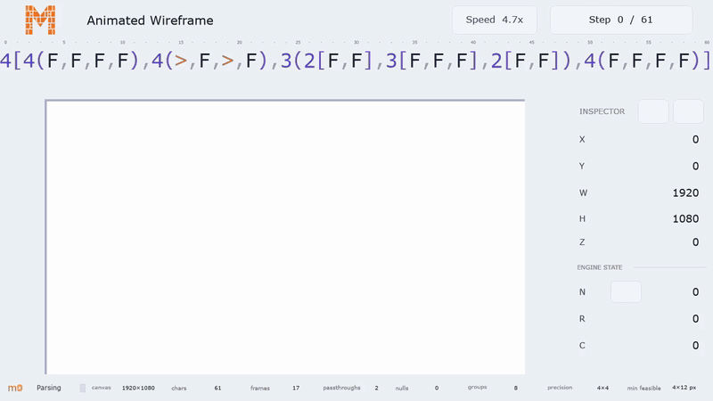
  <br><sub>This is a template too: <a href="https://app.m0saic.io/make?t=@m0saic/dsl-tutorial/v2&p=zq1YqLkhNTfEtzSnJLMjJTC1SsjLRs6gFAA">open it in Mosaic Web</a> and change the m0 string.</sub>
</p>

m0saic is a video compiler. A m0saic template is a TypeScript program that returns an **[m0](https://github.com/m0saic-dsl/m0)**
string (rectangles on a canvas) and one source per rectangle; m0saic compiles that to ffmpeg and hands you back
media (video or image). There's no browser in the pipeline and no timeline to drag. The same template, props
and canvas always produce the same output, so a render behaves like a build artifact you can test, diff
and re-run from a cron job or a coding agent.

```sh
npx m0saic hello-world
```

That's the whole first run. If you have no ffmpeg it says so, and `npx m0saic setup` fetches a pinned build
with your approval. (Node 18.17+; macOS, Windows and Linux.)

**On this page**

<table width="100%">
  <tr>
    <td valign="top" width="50%" nowrap>
      1. <a href="#what-you-can-do">What you can do</a><br>
      2. <a href="#three-surfaces-one-compiler">Three surfaces, one compiler</a><br>
      3. <a href="#render-something-from-your-data">Render something from your data</a><br>
      4. <a href="#hand-it-to-your-coding-agent">Hand it to your coding agent</a><br>
      5. <a href="#m0">m0</a>
    </td>
    <td valign="top" width="50%" nowrap>
      6. <a href="#what-you-can-make">What you can make</a><br>
      7. <a href="#why-m0saic">Why m0saic?</a><br>
      8. <a href="#remotion-vs-hyperframes-vs-m0saic">Remotion vs HyperFrames vs m0saic</a><br>
      9. <a href="#everything-else">Everything else</a><br>
      10. <a href="#open-and-commercial-plainly">Open and commercial, plainly</a>
    </td>
  </tr>
</table>

## What you can do

**Make a video**

- **Agentically.** Describe it to your coding agent. It writes the template and renders it. In Mosaic Desktop that is a working session, not a one-shot: the agent puts the template on the canvas and asks you a question, you answer in words or by resizing a rectangle, and you edit the same layout together until it is right. Or run the agent headless and let it ship the file.
- **Interactively.** Open a template in Make, where every bound rectangle is a handle. Draw the layout in Layout. Fill one by hand in Compose.
- **Programmatically.** A template is TypeScript and its props are your data. `m0saic make` from any script.

The template and its props are the source of truth, so you can switch between the three at any point.

**Run it**

- **Template libraries.** A repo of templates for your team or your brand: `m0saic init`, publish, and every surface loads it.
- **Batch rendering.** The CLI renders anywhere ffmpeg runs, with no browser in the pipeline: cron, CI, your own servers.
- **Inside your product.** Call the CLI or the MCP server from your own tool, or hand people a Mosaic Web link that opens with the props filled in.

## Three surfaces, one compiler

Mosaic Web is where you look first. Mosaic Desktop is the product. The CLI is what makes it production.

<table>
  <tr>
    <th width="33%" align="center">Mosaic Web</th>
    <th width="33%" align="center">Mosaic Desktop</th>
    <th width="33%" align="center">CLI</th>
  </tr>
  <tr>
    <td align="center"><a href="https://app.m0saic.io/make?t=@m0saic/brand/business-card/v2">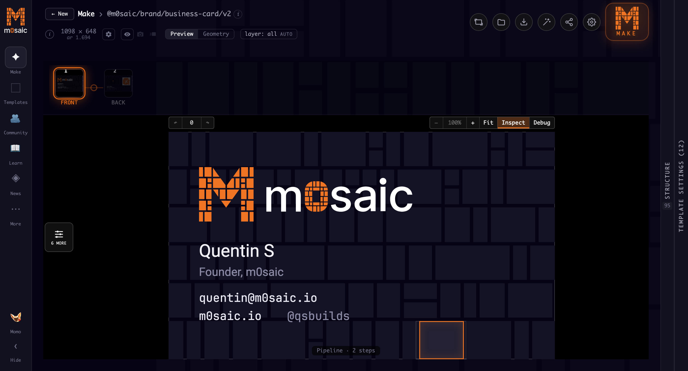</a></td>
    <td align="center"><a href="https://m0saic.io/download">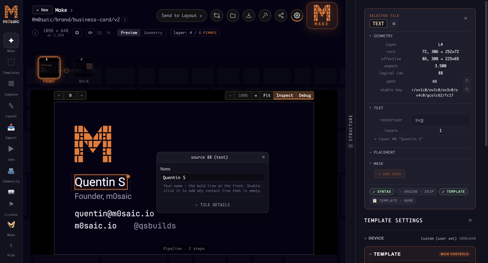</a></td>
    <td align="center"><a href="https://www.npmjs.com/package/m0saic">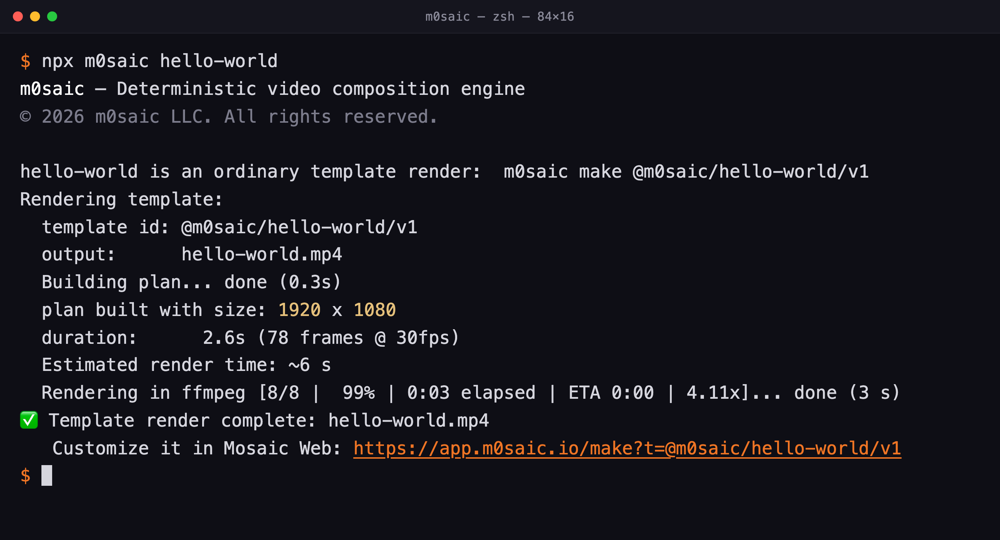</a></td>
  </tr>
  <tr>
    <td align="center"><b><a href="https://app.m0saic.io">app.m0saic.io</a></b><br>nothing to install</td>
    <td align="center"><b><a href="https://m0saic.io/download">Download</a></b><br>macOS and Windows · <a href="https://github.com/m0saic-project/mosaic-desktop-releases/releases">releases</a></td>
    <td align="center"><b><a href="https://www.npmjs.com/package/m0saic">npm i -g m0saic</a></b><br>anywhere ffmpeg runs</td>
  </tr>
  <tr>
    <td align="center">Open a template link and play with it. Rendering is not here; it hands you the CLI command or the Desktop link.</td>
    <td align="center">The complete workspace, with local rendering on your own files.</td>
    <td align="center">Cron jobs, CI, servers, agents. Same templates, same bytes, no UI.</td>
  </tr>
</table>

| | Web | Desktop | CLI |
|---|:-:|:-:|:-:|
| ✦ **[Make](https://app.m0saic.io/make)** · a template on the live canvas; every bound rectangle is a handle | a playground and editor for the web-safe templates | the full Make page | `make` |
| 🎬 **Render** · ffmpeg on your machine | hands you the command | through Make | `make` |
| ▶ **Automation** · cron, CI, a schedule | n/a | the Jobs queue | `make` from any script |
| ⬚ **[Templates](https://app.m0saic.io/templates)** · the library, with previews and props | ✓ | ✓ | `list-templates` |
| ▨ **Compose** · start from a layout and fill the rectangles yourself: a `.mosaicx` built by hand instead of by a template | Desktop only | ✓ | n/a |
| ✎ **[Layout](https://app.m0saic.io/layout)** · the m0 editor | ✓ share by URL | ✓ | `"3(1,1,1)"`, `--anim` |
| 📥 **[Import](https://app.m0saic.io/svg-to-mosaic)** · an SVG in, an m0 layout out | ✓ | ✓ | n/a |
| ✳ **Agent** · workspaces, a shell with the MCP server wired in, the harness picker (agent-agnostic: bring your own) | Desktop only | ✓ | `mcp`, `init` |
| 🫂 **[Community](https://app.m0saic.io/community)** · one tile per contributor | ✓ | ✓ seeded, signed updates | `--community-repo` |
| 📖 **[Learn](https://app.m0saic.io/learn)** · guided tours of Make and m0 | ✓ | ✓ | n/a |
| ◈ **[News](https://app.m0saic.io/news)** · what changed, release by release | ✓ | ✓ | n/a |
| 🔧 **Tools** · ffmpeg toolchains, bundled versions, diagnostics | Desktop only | ✓ | `setup`, `versions`, `doctor` |
| 🗂 **[File types](https://github.com/m0saic-dsl/m0/blob/main/FILE-FORMATS.md)** · `.m0`, `.m0c`, `.m0p`, `.m0v`, `.mosaic`, `.mosaicx` | save and open | registered, with file icons on macOS and Windows | `make`, `resolve`, `open` |
| ◔ **[Telemetry](TELEMETRY.md)** · standard / local / ghost | n/a | ✓ | `telemetry` |
| ⚑ **License** · activate a key | n/a | ✓ | `activate`, `license` |

## Render something from your data

```sh
npm i -g m0saic
m0saic setup --yes
m0saic make @m0saic/alpine/leaderboard/v2 --props @examples/leaderboard/leaderboard.json -o leaderboard.mp4
```

<p align="center">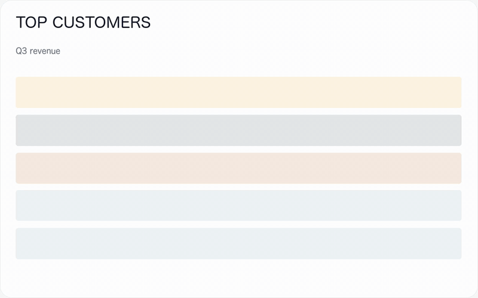</p>

Five names and five numbers in ([leaderboard.json](examples/leaderboard/leaderboard.json)), a ranked board
out, and the motion comes from the data: the values count up, the ranks land. `--output-kind image` gives
the still. `-w 1080 -h 1920` re-lays the same template for a vertical post; nothing is letterboxed. The same
idea at full size is the leadership walkthrough in the gallery below: a quarter's export in, a narrated,
zooming review out. `m0saic list-templates` shows every template, and
[m0saic.io/llms-full.txt](https://m0saic.io/llms-full.txt) lists each one with its props.

## Hand it to your coding agent

m0saic is not an AI video generator. There is no prompt-to-video here and no model inside. It is a video
compiler, and agents are good at it for the same reason they are good at any compiler: they write code against it, the
same code you could write yourself. An m0 string is one line a validator can check, and a m0saic template is
TypeScript, so most people hand that part to a coding agent and review the result. Bring whichever agent you
like. This repo is a Claude Code plugin and a set of Agent Skills, both wired to the m0saic MCP server.

**Claude Code**, as a plugin (skills + the MCP server):

```
/plugin marketplace add m0saic-project/m0saic
/plugin install m0saic@m0saic
```

**Any agent that reads [Agent Skills](https://agentskills.io)** (Codex, Cursor, Gemini CLI, OpenCode, Copilot and more):

```sh
npx skills add m0saic-project/m0saic
```

**Just the MCP server** (the knowledge base, every template's props, the layout validator, one-frame renders, the publish checks, and a live link into Mosaic Desktop):

```sh
claude mcp add --scope user m0saic -- npx -y m0saic mcp     # Claude Code
codex mcp add m0saic -- npx -y m0saic mcp                   # Codex
gemini extensions install https://github.com/m0saic-project/m0saic   # Gemini CLI
```

Cursor, Windsurf, Claude Desktop and other `mcpServers` clients:

```json
{ "mcpServers": { "m0saic": { "command": "npx", "args": ["-y", "m0saic", "mcp"] } } }
```

Then ask for what you want: *"make a 15-second vertical video of this week's commits"*, *"turn this CSV
into a bar chart I can post"*, *"build me a template for my podcast's episode cards"*. The skills tell the
agent when to render with an existing template and when to write a new one.

<p align="center">
  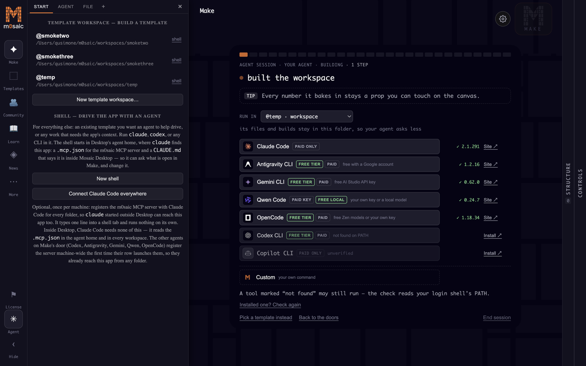
  <br><sub>In Mosaic Desktop the agent works in the room: pick a harness (Claude Code, Codex, Gemini CLI, Qwen Code, OpenCode, Antigravity, Copilot, or your own command), it builds in a template workspace, and the template opens on the canvas when it lands.</sub>
</p>

## m0

`(` splits across, `[` splits down, `{}` layers content over a tile. Click a string to open it in Layout; expand it for the wireframe.

<details>
<summary><a href="https://app.m0saic.io/layout?m0=3%28F%2CF%2CF%29&w=1920&h=1080"><code>3(1,1,1)</code></a> · three equal columns</summary>
<p align="center">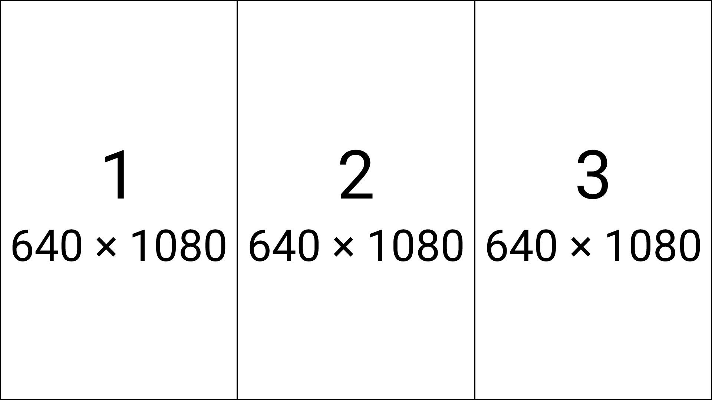</p>
</details>
<details>
<summary><a href="https://app.m0saic.io/layout?m0=2%28F%2C3%5BF%2CF%2CF%5D%29&w=1920&h=1080"><code>2(F,3[F,F,F])</code></a> · a column beside three stacked rows</summary>
<p align="center">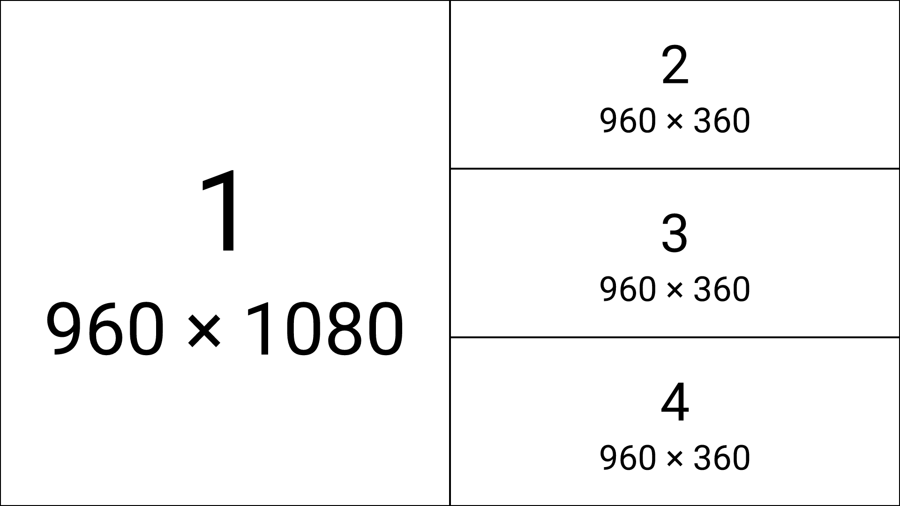</p>
</details>
<details>
<summary><a href="https://app.m0saic.io/layout?m0=2%5BF%2CF%5D%7BF%7D&w=1920&h=1080"><code>2[F,F]{F}</code></a> · two rows, with a layer on top</summary>
<p align="center">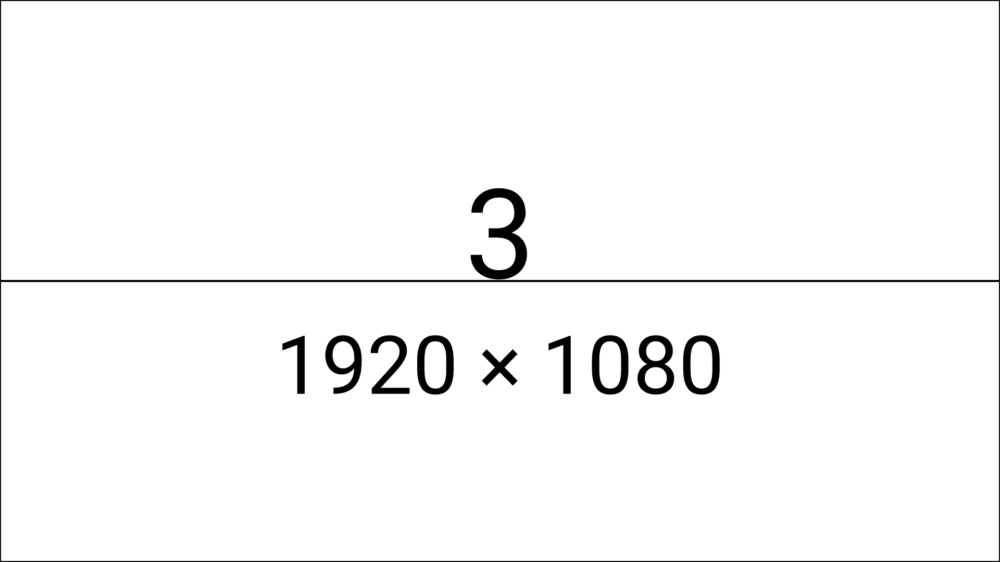</p>
</details>

Every rectangle gets integer pixel bounds: a three-way split of 1920 is 640/640/640, and when a split doesn't divide, the remainder is handed
out the same way every time. `npx m0saic "3(1,1,1)" --anim` renders any m0 string you type as an animated
wireframe. m0 is closed under composition: any template can nest any other, because it all resolves to
geometry.

Real templates are (much) longer strings. The language repo keeps the geometry of every shipped template as a
visual-test golden, one `.m0` file each. Same deal: click to open the exact string in Layout, expand for the wireframe.

<details>
<summary><a href="https://app.m0saic.io/layout?m0=1080%5B13%3E-%2C70%3E1920%2865%3E-%2C71%3EF%2C82%3E-%2C441%3EF%2C559%3E-%2C237%3EF%2C33%3E-%2C373%3EF%2C50%3E-%29%2C13%3E-%2C13%3EF%2C3%3E-%2C75%3EF%2C4%3EF%2C54%3E32%28-%2C29%3EF%2C-%29%2C10%3E-%2C749%3E1920%28102%3E-%2C1329%3EF%2C486%3E-%29%2C10%3E-%2C43%3E120%28-%2C2%3EF%2C115%3E-%29%2C10%3E-%5D%7B1080%5B13%3E-%2C70%3E1920%281246%3E-%2C189%3EF%2C95%3E-%2C297%3EF%2C88%3E-%29%2C31%3E-%2C75%3EF%2C70%3E-%2C749%3E1920%28102%3E-%2C1329%3EF%2C486%3E-%29%2C9%3E-%2C45%3E1920%2895%3E-%2C111%3EF%2C31%3E-%2C65%3EF%2C10%3E-%2C97%3EF%2C32%3E-%2C94%3EF%2C17%3E-%2C37%3EF%2C56%3E-%2C103%3EF%2C16%3E-%2C33%3EF%2C52%3E-%2C136%3EF%2C10%3E-%2C23%3EF%2C35%3E-%2C94%3EF%2C17%3E-%2C37%3EF%2C56%3E-%2C103%3EF%2C16%3E-%2C33%3EF%2C52%3E-%2C116%3EF%2C12%3E-%2C38%3EF%2C38%3E-%2C112%3EF%2C8%3E-%2C55%3EF%2C45%3E-%29%2C9%3E-%5D%7B360%5B87%3E-%2C249%3E1920%28102%3E-%2C1329%3EF%2C486%3E-%29%2C6%3E-%2C7%3E120%2812%3E-%2CF%2C105%3E-%29%2C6%3E-%5D%7B180%5B43%3E-%2C124%3E1920%28102%3E-%2C1329%3EF%2C486%3E-%29%2C10%3E-%5D%7B180%5B43%3E-%2C124%3E1920%28102%3E-%2C1329%3EF%2C486%3E-%29%2C10%3E-%5D%7B180%5B43%3E-%2C124%3E1920%28102%3E-%2C1329%3EF%2C486%3E-%29%2C10%3E-%5D%7B180%5B43%3E-%2C124%3E1920%28102%3E-%2C1329%3EF%2C486%3E-%29%2C10%3E-%5D%7B1080%5B263%3E-%2C65%3E1920%281557%3E-%2C139%3EF%2C19%3E-%2C80%3EF%2C10%3E-%2C87%3EF%2C21%3E-%29%2C11%3E-%2C59%3E80%2864%3E-%2C2%3EF%2C4%3E-%2C5%3EF%2C-%29%2C11%3E-%2C59%3E80%2864%3E-%2C2%3EF%2C4%3E-%2C5%3EF%2C-%29%2C11%3E-%2C59%3E80%2864%3E-%2C2%3EF%2C4%3E-%2C5%3EF%2C-%29%2C11%3E-%2C58%3E80%2864%3E-%2C2%3EF%2C4%3E-%2C5%3EF%2C-%29%2C9%3E-%2C56%3E80%2864%3E-%2C2%3EF%2C4%3E-%2C5%3EF%2C-%29%2C23%3E-%2C35%3E480%28387%3E-%2C36%3EF%2C54%3E-%29%2C17%3E-%2C59%3E160%28129%3E-%2C5%3EF%2C-%2C6%3EF%2C%3E%2C-%2C11%3EF%2C%3E%2C-%29%2C11%3E-%2C59%3E80%2864%3E-%2C2%3EF%2C4%3E-%2C5%3EF%2C-%29%2C11%3E-%2C59%3E80%2864%3E-%2C2%3EF%2C4%3E-%2C5%3EF%2C-%29%2C113%3E-%5D%7B1080%5B263%3E-%2C65%3E1920%281726%3E-%2C63%3EF%2C27%3E-%2C69%3EF%2C30%3E-%29%2C11%3E-%2C59%3E160%28146%3E-%2C9%3EF%2C2%3E-%29%2C11%3E-%2C59%3E160%28146%3E-%2C9%3EF%2C2%3E-%29%2C11%3E-%2C59%3E160%28146%3E-%2C9%3EF%2C2%3E-%29%2C11%3E-%2C58%3E160%28146%3E-%2C9%3EF%2C2%3E-%29%2C9%3E-%2C56%3E160%28146%3E-%2C9%3EF%2C2%3E-%29%2C40%3E-%2C2%3E1920%281706%3E-%2C196%3EF%2C15%3E-%29%2C33%3E-%2C59%3E640%28550%3E-%2C21%3EF%2C14%3E-%2C39%3EF%2C11%3E-%29%2C11%3E-%2C59%3E160%28146%3E-%2C9%3EF%2C2%3E-%29%2C11%3E-%2C59%3E160%28146%3E-%2C9%3EF%2C2%3E-%29%2C113%3E-%5D%7B180%5B43%3E-%2C10%3E1920%281726%3E-%2C63%3EF%2C27%3E-%2C69%3EF%2C30%3E-%29%2C71%3E-%2C9%3E640%28550%3E-%2C21%3EF%2C66%3E-%29%2C42%3E-%5D%7B180%5B43%3E-%2C10%3E1920%281726%3E-%2C63%3EF%2C27%3E-%2C69%3EF%2C30%3E-%29%2C124%3E-%5D%7B180%5B43%3E-%2C10%3E1920%281818%3E-%2C69%3EF%2C30%3E-%29%2C124%3E-%5D%7B180%5B43%3E-%2C10%3E1920%281818%3E-%2C69%3EF%2C30%3E-%29%2C124%3E-%5D%7D%7D%7D%7D%7D%7D%7D%7D%7D%7D%7D%7D&w=1920&h=1080"><code>real__dsl-tutorial-v1.m0</code></a> · the tutorial video at the top of this page, 85,467 characters</summary>
<p align="center">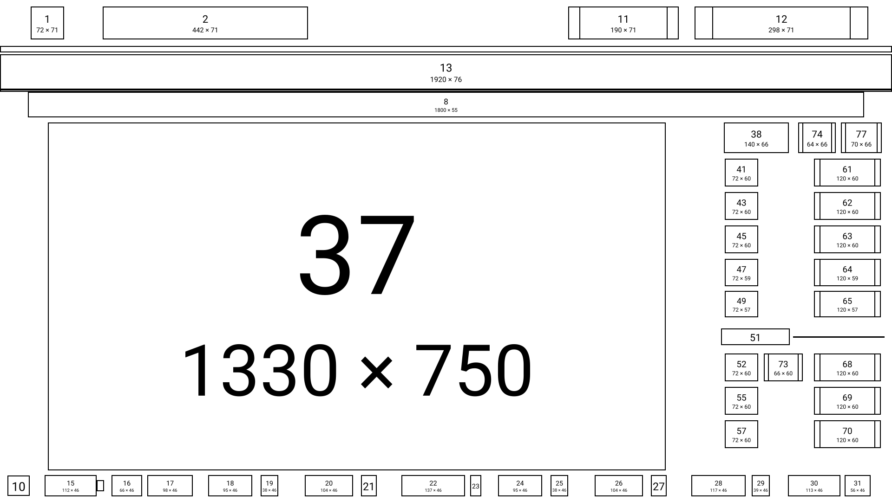<br><sub><a href="https://github.com/m0saic-dsl/m0/blob/main/packages/dsl-visual-tests/src/realWorld/__goldens__/real__dsl-tutorial-v1.m0">the .m0 file</a> · 1920×1080</sub></p>
</details>
<details>
<summary><a href="https://app.m0saic.io/layout?m0=F%7B800%5B48%3E-%2C101%3E1280%2842%3E-%2C1193%3EF%2C42%3E-%29%2C23%3E-%2C515%3E1280%28372%3E-%2C281%3EF%2C624%3E-%29%2C108%3E-%5D%7B800%5B348%3E-%2C94%3E1280%28510%3E-%2C137%3EF%2C630%3E-%29%2C4%3E-%2C277%3E256%2818%3E-%2C81%3EF%2C154%3E-%29%2C72%3E-%5D%7B800%5B174%3E-%2C278%3E1280%2894%3E-%2C282%3EF%2C901%3E-%29%2C29%3E-%2C13%3E640%28366%3E-%2C26%3EF%2C245%3E-%29%2C30%3E-%2C137%3E1280%28462%3E-%2C143%3EF%2C672%3E-%29%2C132%3E-%5D%7B800%5B174%3E-%2C131%3E1280%28372%3E-%2C77%3EF%2C828%3E-%29%2C96%3E-%2C13%3E640%28366%3E-%2C26%3EF%2C245%3E-%29%2C30%3E-%2C79%3E1280%28516%3E-%2C137%3EF%2C624%3E-%29%2C59%3E-%2C137%3E1280%28372%3E-%2C89%3EF%2C816%3E-%29%2C72%3E-%5D%7B800%5B180%3E-%2C137%3E1280%28250%3E-%2C106%3EF%2C34%3E-%2C105%3EF%2C780%3E-%29%2C77%3E-%2C81%3E1280%28522%3E-%2C131%3EF%2C624%3E-%29%2C19%3E-%2C125%3E1280%28486%3E-%2C143%3EF%2C648%3E-%29%2C174%3E-%5D%7B800%5B192%3E-%2C143%3E1280%28208%3E-%2C119%3EF%2C91%3E-%2C125%3EF%2C732%3E-%29%2C47%3E-%2C68%3E1280%2894%3E-%2C131%3EF%2C1052%3E-%29%2C19%3E-%2C108%3E1280%28504%3E-%2C143%3EF%2C630%3E-%29%2C216%3E-%5D%7B800%5B222%3E-%2C137%3E1280%28450%3E-%2C137%3EF%2C690%3E-%29%2C34%3E-%2C29%3E1280%28814%3E-%2C286%3EF%2C134%3EF%2C42%3E-%29%2C22%3E-%2C73%3E1280%2894%3E-%2C131%3EF%2C1052%3E-%29%2C29%3E-%2C137%3E1280%28178%3E-%2C131%3EF%2C133%3E-%2C125%3EF%2C708%3E-%29%2C108%3E-%5D%7B800%5B252%3E-%2C131%3E1280%28474%3E-%2C143%3EF%2C660%3E-%29%2C58%3E-%2C13%3E640%28366%3E-%2C26%3EF%2C245%3E-%29%2C10%3E-%2C107%3E1280%28100%3E-%2C137%3EF%2C1040%3E-%29%2C137%3E1280%28402%3E-%2C101%3EF%2C774%3E-%29%2C84%3E-%5D%7B800%5B294%3E-%2C118%3E1280%28498%3E-%2C143%3EF%2C636%3E-%29%2C21%3E-%2C29%3E1280%28814%3E-%2C286%3EF%2C134%3EF%2C42%3E-%29%2C17%3E-%2C56%3E1280%28292%3E-%2C163%3EF%2C822%3E-%29%2C53%3E-%2C131%3E1280%28328%3E-%2C79%3EF%2C870%3E-%29%2C72%3E-%5D%7B800%5B174%3E-%2C131%3E1280%28304%3E-%2C72%3EF%2C901%3E-%29%2C23%3E-%2C102%3E1280%28100%3E-%2C137%3EF%2C1040%3E-%29%2C41%3E-%2C29%3E1280%28814%3E-%2C286%3EF%2C134%3EF%2C42%3E-%29%2C82%3E-%2C131%3E1280%28268%3E-%2C98%3EF%2C911%3E-%29%2C78%3E-%5D%7B800%5B288%3E-%2C119%3E1280%28112%3E-%2C143%3EF%2C1022%3E-%29%2C161%3E-%2C143%3E1280%28220%3E-%2C119%3EF%2C938%3E-%29%2C84%3E-%5D%7B800%5B246%3E-%2C131%3E1280%28136%3E-%2C137%3EF%2C1004%3E-%29%2C143%3E-%2C137%3E1280%28142%3E-%2C137%3EF%2C998%3E-%29%2C138%3E-%5D%7B800%5B216%3E-%2C137%3E1280%28166%3E-%2C131%3EF%2C980%3E-%29%2C5%3E-%2C82%3E1280%28492%3E-%2C179%3EF%2C606%3E-%29%2C54%3E-%2C119%3E1280%28118%3E-%2C137%3EF%2C1022%3E-%29%2C180%3E-%5D%7B800%5B258%3E-%2C89%3E1280%28130%3E-%2C185%3EF%2C962%3E-%29%2C41%3E-%2C82%3E256%2836%3E-%2C75%3EF%2C142%3E-%29%2C114%3E-%2C83%3E1280%28178%3E-%2C178%3EF%2C921%3E-%29%2C126%3E-%5D%7D%7D%7D%7D%7D%7D%7D%7D%7D%7D%7D%7D%7D%7D&w=1280&h=800"><code>real__alpine-donut-v3.m0</code></a> · the donut chart, 124,796 characters</summary>
<p align="center">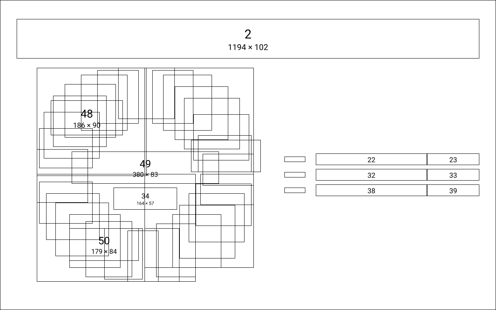<br><sub><a href="https://github.com/m0saic-dsl/m0/blob/main/packages/dsl-visual-tests/src/realWorld/__goldens__/real__alpine-donut-v3.m0">the .m0 file</a> · 1280×800</sub></p>
</details>
<details>
<summary><a href="https://app.m0saic.io/layout?m0=F%7B900%5B64%3E-%2C77%3E1600%2841%3E-%2C142%3EF%2C1414%3E-%29%2C59%3E-%2C119%3E800%2820%3E-%2C757%3EF%2C20%3E-%29%2C19%3E-%2C113%3E800%2820%3E-%2C757%3EF%2C20%3E-%29%2C18%3E-%2C113%3E800%2820%3E-%2C757%3EF%2C20%3E-%29%2C18%3E-%2C113%3E800%2820%3E-%2C757%3EF%2C20%3E-%29%2C18%3E-%2C119%3E800%2820%3E-%2C757%3EF%2C20%3E-%29%2C37%3E-%5D%7B900%5B37%3E-%2C73%3E1600%28214%3E-%2C1342%3EF%2C41%3E-%29%2C57%3E1600%28214%3E-%2C1342%3EF%2C41%3E-%29%2C56%3E-%2C71%3E800%2828%3E-%2C7%3EF%2C762%3E-%29%2C66%3E-%2C67%3E800%2828%3E-%2C7%3EF%2C762%3E-%29%2C64%3E-%2C67%3E800%2828%3E-%2C7%3EF%2C762%3E-%29%2C64%3E-%2C67%3E800%2828%3E-%2C7%3EF%2C762%3E-%29%2C65%3E-%2C71%3E800%2828%3E-%2C7%3EF%2C762%3E-%29%2C61%3E-%5D%7B900%5B232%3E-%2C59%3E800%2844%3E-%2C31%3EF%2C722%3E-%29%2C78%3E-%2C55%3E800%2844%3E-%2C31%3EF%2C722%3E-%29%2C76%3E-%2C55%3E800%2844%3E-%2C31%3EF%2C722%3E-%29%2C76%3E-%2C55%3E800%2844%3E-%2C31%3EF%2C722%3E-%29%2C77%3E-%2C59%3E800%2844%3E-%2C31%3EF%2C722%3E-%29%2C67%3E-%5D%7B900%5B248%3E-%2C27%3E400%2826%3E-%2C6%3EF%2C365%3E-%29%2C%3E%2C-%2C23%3E1600%281219%3E-%2C44%3EF%2C21%3E-%2C44%3EF%2C267%3E-%29%2C82%3E-%2C27%3E400%2826%3E-%2C6%3EF%2C365%3E-%29%2C%3E%2C-%2C20%3E800%28630%3E-%2C34%3EF%2C133%3E-%29%2C81%3E-%2C27%3E400%2826%3E-%2C6%3EF%2C365%3E-%29%2C%3E%2C-%2C20%3E1600%281219%3E-%2C44%3EF%2C21%3E-%2C44%3EF%2C267%3E-%29%2C81%3E-%2C27%3E400%2826%3E-%2C6%3EF%2C365%3E-%29%2C%3E%2C-%2C20%3E800%28630%3E-%2C34%3EF%2C133%3E-%29%2C84%3E-%2C27%3E400%2826%3E-%2C6%3EF%2C365%3E-%29%2C%3E%2C-%2C23%3E800%28630%3E-%2C34%3EF%2C133%3E-%29%2C57%3E-%5D%7B900%5B214%3E-%2C49%3E1600%28184%3E-%2C1137%3EF%2C218%3EF%2C57%3E-%29%2C5%3E-%2C39%3E1600%28184%3E-%2C307%3EF%2C27%3E-%2C698%3EF%2C111%3E-%2C209%3EF%2C57%3E-%29%2C43%3E-%2C46%3E1600%28184%3E-%2C1137%3EF%2C218%3EF%2C57%3E-%29%2C5%3E-%2C36%3E1600%28184%3E-%2C307%3EF%2C27%3E-%2C740%3EF%2C69%3E-%2C209%3EF%2C57%3E-%29%2C42%3E-%2C46%3E1600%28184%3E-%2C1137%3EF%2C218%3EF%2C57%3E-%29%2C5%3E-%2C36%3E1600%28184%3E-%2C307%3EF%2C27%3E-%2C698%3EF%2C111%3E-%2C209%3EF%2C57%3E-%29%2C42%3E-%2C46%3E1600%28184%3E-%2C1137%3EF%2C218%3EF%2C57%3E-%29%2C5%3E-%2C36%3E1600%28184%3E-%2C181%3EF%2C27%3E-%2C866%3EF%2C69%3E-%2C209%3EF%2C57%3E-%29%2C42%3E-%2C49%3E1600%28184%3E-%2C1137%3EF%2C218%3EF%2C57%3E-%29%2C5%3E-%2C39%3E1600%28184%3E-%2C251%3EF%2C27%3E-%2C796%3EF%2C69%3E-%2C209%3EF%2C57%3E-%29%2C49%3E-%5D%7B900%5B270%3E-%2C39%3E1600%28184%3E-%2C307%3EF%2C1106%3E-%29%2C96%3E-%2C36%3E1600%28184%3E-%2C307%3EF%2C1106%3E-%29%2C95%3E-%2C36%3E1600%28184%3E-%2C307%3EF%2C1106%3E-%29%2C95%3E-%2C36%3E1600%28184%3E-%2C181%3EF%2C1232%3E-%29%2C98%3E-%2C39%3E1600%28184%3E-%2C251%3EF%2C1162%3E-%29%2C49%3E-%5D%7B900%5B278%3E-%2C23%3E1600%281219%3E-%2C44%3EF%2C21%3E-%2C44%3EF%2C267%3E-%29%2C112%3E-%2C20%3E800%28630%3E-%2C34%3EF%2C133%3E-%29%2C111%3E-%2C20%3E1600%281219%3E-%2C44%3EF%2C21%3E-%2C44%3EF%2C267%3E-%29%2C111%3E-%2C20%3E800%28630%3E-%2C34%3EF%2C133%3E-%29%2C114%3E-%2C23%3E800%28630%3E-%2C34%3EF%2C133%3E-%29%2C57%3E-%5D%7D%7D%7D%7D%7D%7D%7D&w=1600&h=900"><code>real__alpine-commit-feed-v2.m0</code></a> · the commit feed, 120,809 characters</summary>
<p align="center">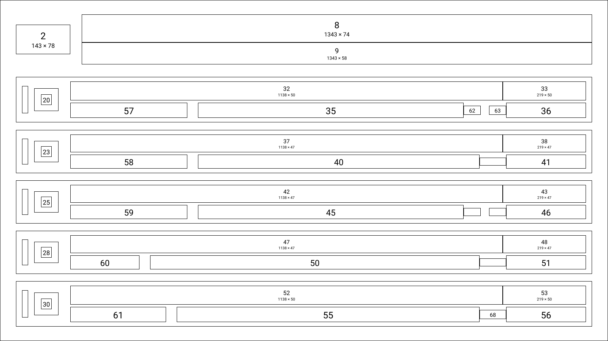<br><sub><a href="https://github.com/m0saic-dsl/m0/blob/main/packages/dsl-visual-tests/src/realWorld/__goldens__/real__alpine-commit-feed-v2.m0">the .m0 file</a> · 1600×900</sub></p>
</details>
<details>
<summary><a href="https://app.m0saic.io/layout?m0=F%7B120%5B4%3E-%2C31%3E15%28-%2C12%3EF%2C-%29%2C3%3E-%2C69%3E120%287%3E-%2C62%3EF%2C39%3EF%2C8%3E-%29%2C8%3E-%5D%7B1080%5B62%3E-%2C44%3E120%288%3E-%2C7%3EF%2C102%3E-%29%2C26%3E-%2C116%3E120%288%3E-%2C6%3EF%2C103%3E-%29%2C26%3E-%2C35%3E480%2835%3E-%2C190%3EF%2C252%3E-%29%2C95%3E-%2C98%3E240%2820%3E-%2C115%3EF%2C102%3E-%29%2C13%3E-%2C98%3E240%2820%3E-%2C115%3EF%2C102%3E-%29%2C13%3E-%2C92%3E240%2820%3E-%2C115%3EF%2C102%3E-%29%2C13%3E-%2C98%3E240%2820%3E-%2C115%3EF%2C102%3E-%29%2C13%3E-%2C98%3E240%2820%3E-%2C115%3EF%2C102%3E-%29%2C24%3E-%2C89%3E120%287%3E-%2C36%3EF%2C74%3E-%29%2C8%3E-%5D%7B1080%5B62%3E-%2C44%3E120%288%3E-%2C7%3EF%2C102%3E-%29%2C44%3E-%2C89%3E120%2816%3E-%2C60%3EF%2C41%3E-%29%2C187%3E-%2C58%3E960%2891%3E-%2C2%3EF%2C864%3E-%29%2C53%3E-%2C58%3E960%2891%3E-%2C2%3EF%2C864%3E-%29%2C53%3E-%2C52%3E960%2891%3E-%2C2%3EF%2C864%3E-%29%2C53%3E-%2C58%3E960%2891%3E-%2C2%3EF%2C864%3E-%29%2C53%3E-%2C58%3E960%2891%3E-%2C2%3EF%2C864%3E-%29%2C62%3E-%2C53%3E120%288%3E-%2C34%3EF%2C75%3E-%29%2C26%3E-%5D%7B1080%5B435%3E-%2C49%3E960%28103%3E-%2C24%3EF%2C830%3E-%29%2C62%3E-%2C49%3E960%28103%3E-%2C24%3EF%2C830%3E-%29%2C62%3E-%2C43%3E960%28103%3E-%2C24%3EF%2C830%3E-%29%2C62%3E-%2C49%3E960%28103%3E-%2C24%3EF%2C830%3E-%29%2C62%3E-%2C49%3E960%28103%3E-%2C24%3EF%2C830%3E-%29%2C147%3E-%5D%7B1080%5B425%3E-%2C39%3E1920%28277%3E-%2C662%3EF%2C9%3E-%2C128%3EF%2C839%3E-%29%2C29%3E1920%28277%3E-%2C99%3EF%2C11%3E-%2C484%3EF%2C83%3E-%2C120%3EF%2C839%3E-%29%2C42%3E-%2C39%3E1920%28277%3E-%2C662%3EF%2C9%3E-%2C128%3EF%2C839%3E-%29%2C29%3E1920%28277%3E-%2C111%3EF%2C11%3E-%2C503%3EF%2C52%3E-%2C120%3EF%2C839%3E-%29%2C42%3E-%2C33%3E1920%28277%3E-%2C662%3EF%2C9%3E-%2C128%3EF%2C839%3E-%29%2C29%3E1920%28277%3E-%2C111%3EF%2C11%3E-%2C472%3EF%2C83%3E-%2C120%3EF%2C839%3E-%29%2C42%3E-%2C39%3E1920%28277%3E-%2C662%3EF%2C9%3E-%2C128%3EF%2C839%3E-%29%2C29%3E1920%28277%3E-%2C55%3EF%2C11%3E-%2C559%3EF%2C52%3E-%2C120%3EF%2C839%3E-%29%2C42%3E-%2C39%3E1920%28277%3E-%2C662%3EF%2C9%3E-%2C128%3EF%2C839%3E-%29%2C29%3E1920%28277%3E-%2C77%3EF%2C11%3E-%2C537%3EF%2C52%3E-%2C120%3EF%2C839%3E-%29%2C137%3E-%5D%7B1080%5B467%3E-%2C25%3E1920%28891%3E-%2C25%3EF%2C4%3E-%2C25%3EF%2C970%3E-%29%2C86%3E-%2C25%3E1920%28922%3E-%2C25%3EF%2C970%3E-%29%2C80%3E-%2C25%3E1920%28891%3E-%2C25%3EF%2C4%3E-%2C25%3EF%2C970%3E-%29%2C86%3E-%2C25%3E1920%28922%3E-%2C25%3EF%2C970%3E-%29%2C86%3E-%2C25%3E1920%28922%3E-%2C25%3EF%2C970%3E-%29%2C139%3E-%5D%7B1080%5B446%3E-%2C27%3E1920%28218%3E-%2C27%3EF%2C1672%3E-%29%2C84%3E-%2C27%3E1920%28218%3E-%2C27%3EF%2C1672%3E-%29%2C84%3E-%2C21%3E1920%28218%3E-%2C27%3EF%2C1672%3E-%29%2C84%3E-%2C27%3E1920%28218%3E-%2C27%3EF%2C1672%3E-%29%2C84%3E-%2C27%3E1920%28218%3E-%2C27%3EF%2C1672%3E-%29%2C158%3E-%5D%7B1080%5B465%3E-%2C29%3E960%28138%3E-%2C49%3EF%2C770%3E-%29%2C82%3E-%2C29%3E960%28138%3E-%2C55%3EF%2C764%3E-%29%2C76%3E-%2C29%3E960%28138%3E-%2C55%3EF%2C764%3E-%29%2C82%3E-%2C29%3E960%28138%3E-%2C27%3EF%2C792%3E-%29%2C82%3E-%2C29%3E960%28138%3E-%2C38%3EF%2C781%3E-%29%2C137%3E-%5D%7B1080%5B467%3E-%2C25%3E1920%28891%3E-%2C25%3EF%2C4%3E-%2C25%3EF%2C970%3E-%29%2C86%3E-%2C25%3E1920%28922%3E-%2C25%3EF%2C970%3E-%29%2C80%3E-%2C25%3E1920%28891%3E-%2C25%3EF%2C4%3E-%2C25%3EF%2C970%3E-%29%2C86%3E-%2C25%3E1920%28922%3E-%2C25%3EF%2C970%3E-%29%2C86%3E-%2C25%3E1920%28922%3E-%2C25%3EF%2C970%3E-%29%2C139%3E-%5D%7B120%5B42%3E-%2C31%3E120%2872%3E-%2C17%3EF%2C-%2C17%3EF%2C9%3E-%29%2C%3E%2C-%2C31%3E120%2872%3E-%2C17%3EF%2C-%2C17%3EF%2C9%3E-%29%2C10%3E-%5D%7B1080%5B430%3E-%2C48%3E1920%281191%3E-%2C48%3EF%2C20%3E-%2C169%3EF%2C63%3E-%2C48%3EF%2C20%3E-%2C169%3EF%2C183%3E-%29%2C8%3E-%2C92%3E240%28148%3E-%2C29%3EF%2C7%3E-%2C29%3EF%2C22%3E-%29%2C8%3E-%2C39%3E1920%281191%3E-%2C27%3EF%2C10%3E-%2C93%3EF%2C10%3E-%2C95%3EF%2C63%3E-%2C115%3EF%2C9%3E-%2C113%3EF%2C183%3E-%29%2C105%3E-%2C48%3E1920%281191%3E-%2C48%3EF%2C20%3E-%2C169%3EF%2C63%3E-%2C48%3EF%2C20%3E-%2C169%3EF%2C183%3E-%29%2C8%3E-%2C92%3E240%28148%3E-%2C29%3EF%2C7%3E-%2C29%3EF%2C22%3E-%29%2C8%3E-%2C39%3E1920%281191%3E-%2C27%3EF%2C10%3E-%2C93%3EF%2C10%3E-%2C95%3EF%2C63%3E-%2C27%3EF%2C10%3E-%2C93%3EF%2C10%3E-%2C95%3EF%2C183%3E-%29%2C142%3E-%5D%7B1080%5B441%3E-%2C26%3E1920%281202%3E-%2C26%3EF%2C276%3E-%2C26%3EF%2C385%3E-%29%2C278%3E-%2C26%3E1920%281202%3E-%2C26%3EF%2C276%3E-%2C26%3EF%2C385%3E-%29%2C304%3E-%5D%7D%7D%7D%7D%7D%7D%7D%7D%7D%7D%7D%7D&w=1920&h=1080"><code>real__hero-ffmpeg-pulse-notable-commits-v1.m0</code></a> · the repo pulse hero, 176,735 characters</summary>
<p align="center">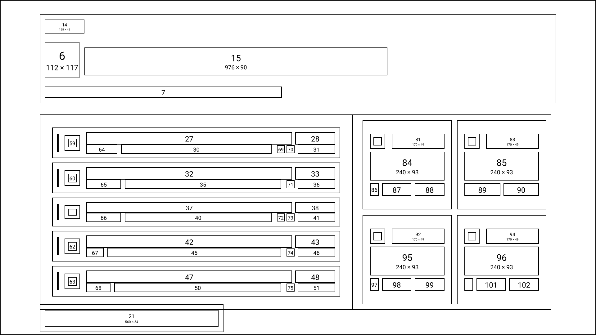<br><sub><a href="https://github.com/m0saic-dsl/m0/blob/main/packages/dsl-visual-tests/src/realWorld/__goldens__/real__hero-ffmpeg-pulse-notable-commits-v1.m0">the .m0 file</a> · 1920×1080</sub></p>
</details>

The whole set is in
[`realWorld/__goldens__`](https://github.com/m0saic-dsl/m0/tree/main/packages/dsl-visual-tests/src/realWorld/__goldens__).
The language is open (Apache-2.0); the official implementation is [m0saic-dsl/m0](https://github.com/m0saic-dsl/m0),
and [m0saic.io/why](https://m0saic.io/why) is the case for rectangles.

## What you can make

Anything you can say as rectangles with known contents. Nine from the library, picked for range:

<table>
  <tr>
    <td width="33%" align="center" valign="top"><a href="https://app.m0saic.io/make?t=@m0saic/media/screencap_grid/v3">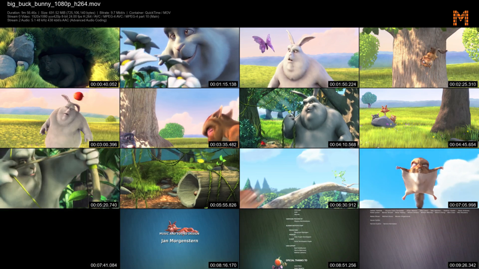</a><br><b>Contact sheet</b> from a video<br><sub><code>@m0saic/media/screencap_grid/v3</code></sub></td>
    <td width="33%" align="center" valign="top"><a href="https://app.m0saic.io/make?t=@m0saic-dev/creator/drop-calendar/v1">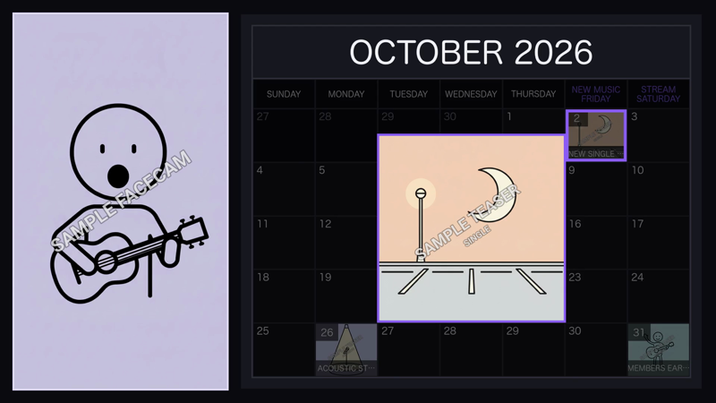</a><br><b>Drop calendar</b> for the month<br><sub><code>@m0saic-dev/creator/drop-calendar/v1</code></sub></td>
    <td width="33%" align="center" valign="top"><a href="https://app.m0saic.io/make?t=@m0saic/alpine/commit-feed/v3">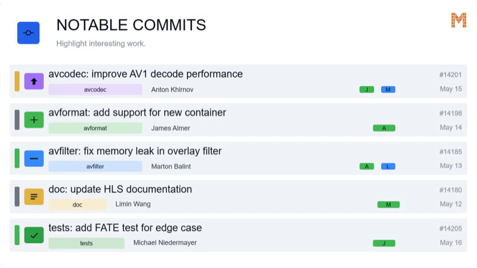</a><br><b>Commit feed</b> from a repo's week<br><sub><code>@m0saic/alpine/commit-feed/v3</code></sub></td>
  </tr>
  <tr>
    <td align="center" valign="top"><a href="https://app.m0saic.io/make?t=@m0saic/brand/business-card/v2">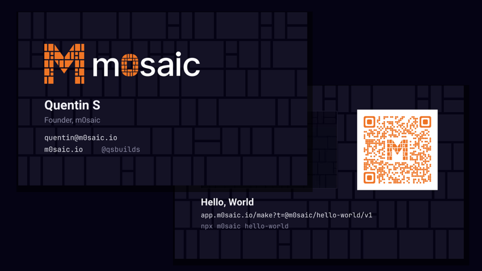</a><br><b>Business card</b> with a QR<br><sub><code>@m0saic/brand/business-card/v2</code></sub></td>
    <td align="center" valign="top"><a href="https://app.m0saic.io/make?t=@m0saic/social/quote-card/v2">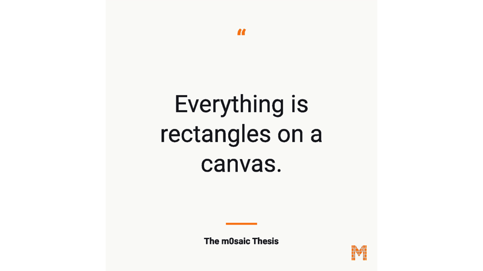</a><br><b>Quote card</b> for a post<br><sub><code>@m0saic/social/quote-card/v2</code></sub></td>
    <td align="center" valign="top"><a href="https://app.m0saic.io/make?t=@m0saic/alpine/heatmap/v3">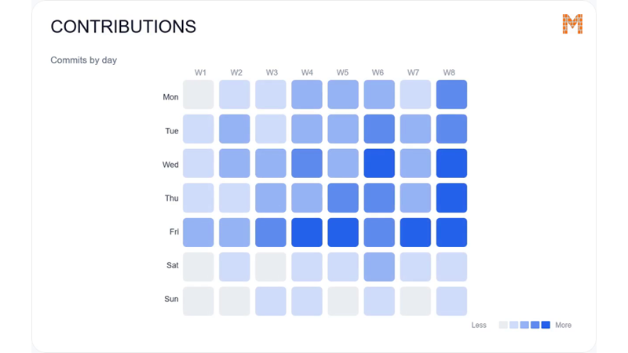</a><br><b>Heatmap</b> of activity by day<br><sub><code>@m0saic/alpine/heatmap/v3</code></sub></td>
  </tr>
  <tr>
    <td align="center" valign="top"><a href="https://app.m0saic.io/make?t=@m0saic/code/snippet-morph/v2">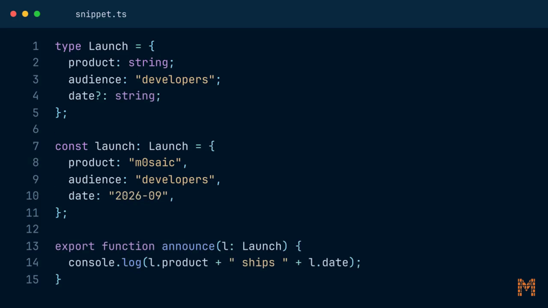</a><br><b>Code walkthrough</b>, line by line<br><sub><code>@m0saic/code/snippet-morph/v2</code></sub></td>
    <td align="center" valign="top"><a href="https://app.m0saic.io/make?t=@m0saic-dev/language/dual-sub/v1">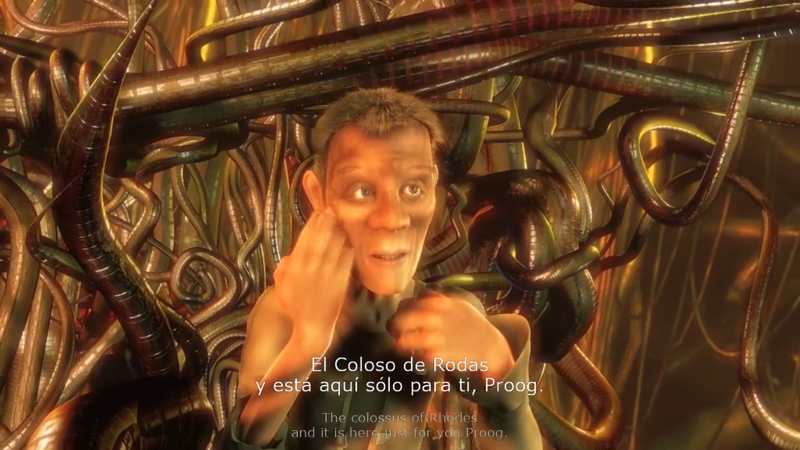</a><br><b>Bilingual subtitles</b> burned in<br><sub><code>@m0saic-dev/language/dual-sub/v1</code></sub></td>
    <td align="center" valign="top"><a href="https://app.m0saic.io/make?t=@m0saic-dev/sales/pipeline-review/v1"></a><br><b>Leadership review</b> of a quarter<br><sub><code>@m0saic-dev/sales/pipeline-review/v1</code></sub></td>
  </tr>
</table>

Also in the library: charts and KPI cards, repo pulses, highlight clips, print dielines, QR codes and
barcodes, photo collages, lyric reels, watermarks, blur regions, title cards, partner maps. More at
[m0saic.io/gallery](https://m0saic.io/gallery) and the [case studies](https://m0saic.io/case-studies), plus a
[community library](https://github.com/m0saic-project/m0saic-community-templates),
[templates written by agents](https://m0saic.io/templates-by-agent), and an agent that ships
[one template a day](https://github.com/m0saic-project/one-a-day).

## Why m0saic?

- **Geometry-native:** a video is an m0 string (rectangles on a canvas) and one source per rectangle. No DOM, no React requirement. Because everything resolves to geometry, any template can render and nest any other. [Why rectangles](https://m0saic.io/why).
- **No browser in the pipeline:** a template outputs a media-intent IR; the compiler lowers that to an ffmpeg graph. Nothing is screenshotted, so a render costs what ffmpeg costs and runs anywhere ffmpeg does.
- **Deterministic by construction:** integer pixel bounds, seeded randomness, no wall clock. The same template, props and canvas give the same bytes.
- **Agents are good at it:** an m0 string is one line a validator checks, a m0saic template is TypeScript, and the MCP server and the skills ship in this repo. The CLI is non-interactive. Bring any agent; m0saic ships no model.
- **Data in, file out:** props are whatever the template declares: JSON rows, pasted CSV, numbers, colours, media files. A quarter's export, a commit log, a budget. Re-render on a schedule, in CI, or when the numbers change.
- **Open language, commercial engine:** the m0 language, its stdlib and file formats are Apache-2.0 and the template libraries are public. The engine is free to use with an attribution mark; Pro removes it.

## Remotion vs HyperFrames vs m0saic

All three make video from code. [Remotion](https://github.com/remotion-dev/remotion)'s bet is React components. [HyperFrames](https://github.com/heygen-com/hyperframes)' bet is plain HTML. m0saic's bet is geometry: an m0 string and one source per rectangle, with no browser anywhere in the render.

| | Remotion | HyperFrames | m0saic |
|---|---|---|---|
| Authoring | React components | HTML + CSS + seekable animation | an m0 string, a TypeScript template, your props |
| Renders through | headless Chrome + FFmpeg | headless Chrome + FFmpeg | FFmpeg only |
| Build step | bundler required | none; `index.html` plays as-is | none to render; `tsc` to author |
| Agent handoff | JSX / React project | plain HTML files | one validated string, typed props, MCP + skills |
| Animation | frame-driven via `useCurrentFrame`; wall-clock libraries need care | seekable, frame-accurate via adapters | per-frame expressions in ffmpeg; no wall clock |
| Distributed rendering | Remotion Lambda | local and AWS Lambda | anywhere ffmpeg runs: local, CI, your servers |
| License | source-available Remotion License | Apache 2.0 | Apache-2.0 language; commercial engine, free with attribution |

If your source of truth is React or HTML, the first two are built for it. If it can be said as rectangles
with known contents, an agent can build it in m0saic too, and the render needs nothing but ffmpeg: data in,
file out, on a server, in CI, from an agent, the same way every time.

Related projects: [Revideo](https://github.com/midrender/revideo), [Motion Canvas](https://github.com/motion-canvas/motion-canvas),
[Editly](https://github.com/mifi/editly), [MoviePy](https://github.com/Zulko/moviepy), [Manim](https://github.com/ManimCommunity/manim).

## Everything else

| | |
|---|---|
| **Write templates** | `m0saic init "My Templates"` scaffolds a repo with AGENTS.md and the MCP config already in it; starters: [full](https://github.com/m0saic-project/m0saic-template-repo-starter), [base](https://github.com/m0saic-project/m0saic-template-repo-starter-base) |
| **VS Code** | the m0saic extension: file icons, wireframe hover previews on any m0 string, inline validation, and JSON schemas for `.m0c` / `.m0p` / `.m0v` / `.mosaic` / `.mosaicx`. On the Marketplace soon |
| **Packages** | the language, stdlib, file formats and template utilities are public: [m0saic-dsl/m0](https://github.com/m0saic-dsl/m0), [m0saic-packages](https://github.com/m0saic-project/m0saic-packages) |
| **For agents** | [m0saic.io/agents](https://m0saic.io/agents) · [m0saic.io/llms.txt](https://m0saic.io/llms.txt) · [m0saic.io/llms-full.txt](https://m0saic.io/llms-full.txt) |
| **Community** | [Discord](https://discord.gg/ns58hGm6Mm) · [r/m0saic](https://reddit.com/r/m0saic) · [Substack](https://mosaicengine.substack.com) · [@qsbuilds](https://x.com/qsbuilds) · the [Community M](https://m0saic.io/community), one tile per contributor |

## Open and commercial, plainly

The m0 language, its stdlib and the file formats are Apache-2.0. The template libraries, the starters and
this repo are public. The engine, the CLI and the apps are commercial software that is free to use: no
account, every template, every resolution, personal or commercial work. The only thing a paid plan changes
is the attribution mark. Free renders carry a small QR mark in one corner; [Pro](https://m0saic.io/pricing)
removes it. The boundary, package by package, is at [m0saic.io/open-core](https://m0saic.io/open-core).

## Issues and questions

Open an issue here for bugs, template requests and questions; this is m0saic's public front door. If m0saic
is useful to you, a star helps other people find it.

<p align="center">
  <sub>Developed and maintained by <strong>m0saic LLC</strong> · <a href="mailto:hi@m0saic.io">hi@m0saic.io</a></sub>
</p>
