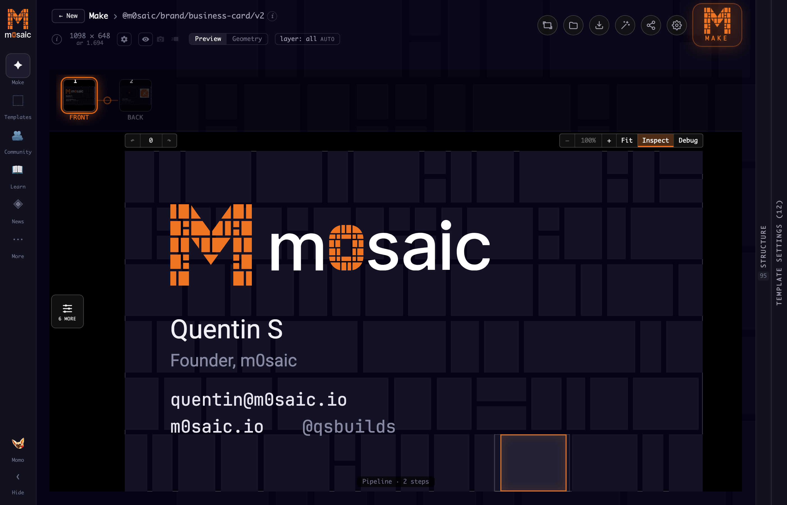
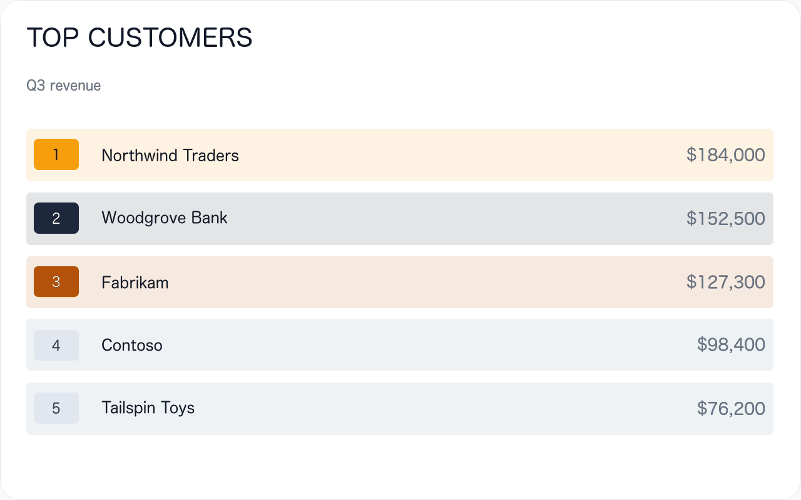
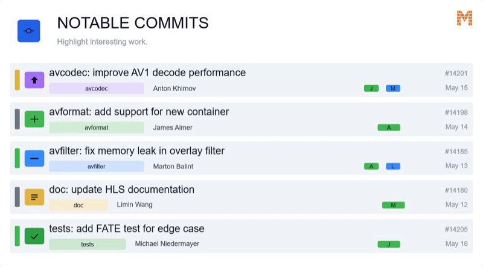
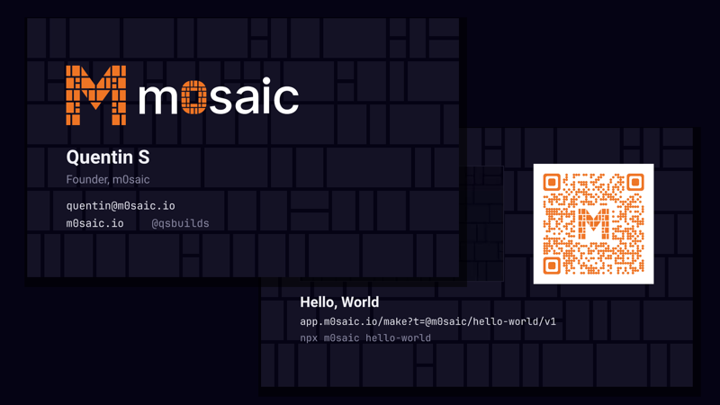
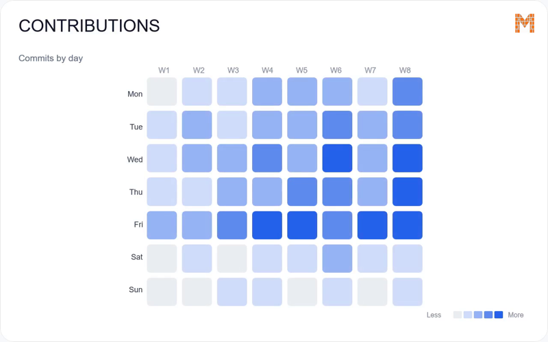
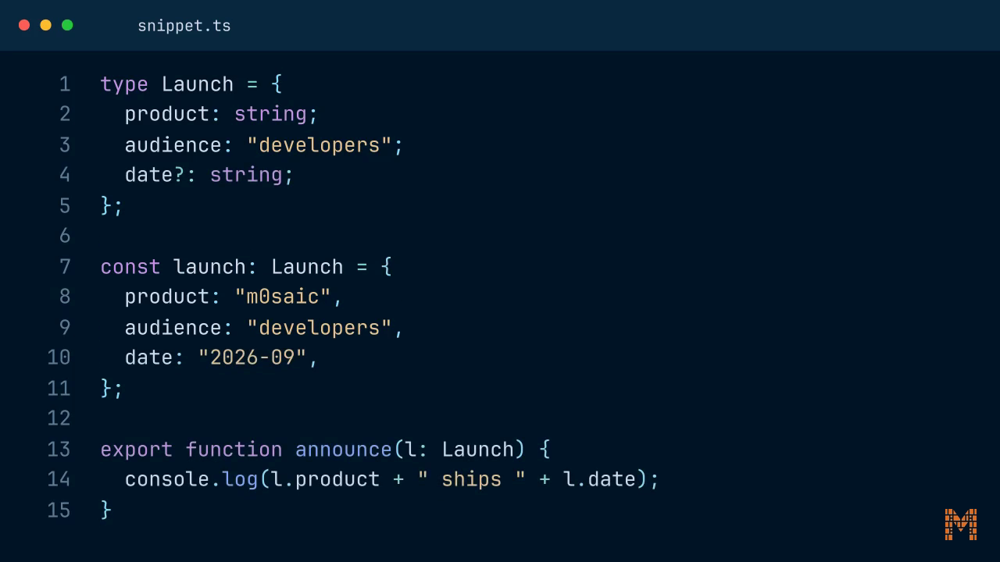
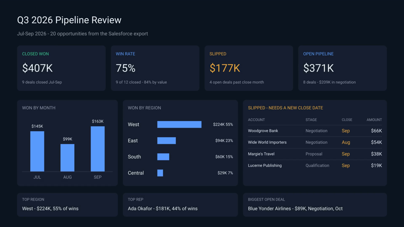

<p align="center">
  <a href="https://m0saic.io">
    <picture>
      <source media="(prefers-color-scheme: dark)" srcset="assets/logo.svg">
      <source media="(prefers-color-scheme: light)" srcset="assets/logo-light.svg">
      
    </picture>
  </a>
</p>

<h3 align="center">Write TypeScript. Compile to video. Built for agents.</h3>

<p align="center">
  <a href="https://www.npmjs.com/package/m0saic"></a>
  <a href="https://m0saic.io"></a>
  <a href="https://app.m0saic.io"></a>
  <a href="https://discord.gg/ns58hGm6Mm"></a>
</p>

<p align="center">
  <a href="https://x.com/qsbuilds"></a>
  <a href="https://mosaicengine.substack.com"></a>
  <a href="https://reddit.com/r/m0saic"></a>
  <a href="mailto:hi@m0saic.io"></a>
</p>

<p align="center">
  
  <br><sub>That is a template too: <a href="https://app.m0saic.io/make?t=@m0saic/dsl-tutorial/v2&p=zq1YqLkhNTfEtzSnJLMjJTC1SsjLRs6gFAA">open it in Mosaic Web</a> and change the m0 string.</sub>
</p>

m0saic is a video compiler. A m0saic template is a TypeScript program that returns an **[m0](https://github.com/m0saic-dsl/m0)**
string (rectangles on a canvas) and one source per rectangle; m0saic compiles that to ffmpeg and hands you back
media (video or image). There's no browser in the pipeline and no timeline to drag. The same template, props
and canvas always produce the same output, so a render behaves like a build artifact you can test, diff
and re-run from a cron job or a coding agent.

```sh
npx m0saic hello-world
```

That's the whole first run. If you have no ffmpeg it says so, and `npx m0saic setup` fetches a pinned build
with your approval. (Node 18.17+; macOS, Windows and Linux.)

## Three surfaces, one compiler

Mosaic Web is where you look first. Mosaic Desktop is the product. The CLI is what makes it production.
One template, the business card, on all three:

| Mosaic Web | Mosaic Desktop |
|:-:|:-:|
| <a href="https://app.m0saic.io/make?t=@m0saic/brand/business-card/v2"></a> | <a href="https://m0saic.io/download"></a> |
| **[app.m0saic.io](https://app.m0saic.io)** · nothing to install | **[Download](https://m0saic.io/download)** · macOS and Windows |

```sh
npm i -g m0saic
m0saic make @m0saic/brand/business-card/v2 --output-kind image -o card.png
```

**[The CLI](https://www.npmjs.com/package/m0saic)** renders anywhere ffmpeg runs: cron jobs, CI, servers,
a build step inside your own product, or an agent's terminal. Same templates, same bytes, no UI.

### What's inside Mosaic Web

Open a template link and play with it: the live preview, the props, the canvas. The web-safe templates run
as they are. Rendering is not here, so it hands you the CLI command or the Desktop link.

| | |
|---|---|
| ✦ **Make** | a web-safe template on the live canvas, where every bound rectangle is a handle |
| ⬚ **Templates** | the whole library, with previews, props and versions |
| ▨ **Compose** | chain templates and files into one pipeline, a `.mosaicx` recipe |
| ✎ **Layout** | the m0 editor: type the string, see the rectangles, share it as a URL |
| 📥 **Import** | an SVG in, an m0 layout out |
| 🫂 **Community** | the community library, one tile per contributor |
| 📖 **Learn** | guided tours of Make and m0 |
| ◈ **News** | what changed, release by release |

### What's inside Mosaic Desktop

The complete workspace, with local rendering on your own files. Everything in the browser, plus:

| | |
|---|---|
| ✦ **Make** | the same canvas with your own media, the Inspect and Debug views (the geometry, effects, masks and overlays each tile compiles to), and a render button |
| ▶ **Jobs** | the render queue: progress, logs, the output files, re-runs |
| ✳ **Agent** | the agent room: template workspaces, a shell with the MCP server already wired in, and the harness picker (Claude Code, Codex, Gemini CLI, Qwen Code, OpenCode, Antigravity, Copilot, or your own command) |
| ▷ **Run** | a `.mosaicx` opened from disk, rendered as-is with the dated output next to it |
| 🫂 **Community** | the community library seeded in the app and kept current from signed releases |
| 🔧 **Tools** | ffmpeg toolchains, the bundled package versions, connections, diagnostics |
| 📺 **Showcase** | the renders, full screen |
| ◔ **Telemetry** | what is recorded locally and what leaves the machine, with the switch |
| ⚑ **License** | activate a key; Free carries the attribution mark, Pro does not |

### What's inside the CLI

| | |
|---|---|
| `m0saic make <id or file>` | render a template id, or a `.mosaic` / `.mosaicx` file, to a video or an image; `--props`, `-w -h`, `--output-kind` |
| `m0saic hello-world` | the first render |
| `m0saic "3(1,1,1)"` | a wireframe PNG of an m0 string, no template needed; `--anim` for the animated MP4 |
| `m0saic list-templates` | every template this install can render, plus any `--template-repo` or `--community-repo` |
| `m0saic init <name>` | a template workspace with `AGENTS.md` and the MCP config already in it |
| `m0saic mcp` | the MCP server on stdio, for any coding agent |
| `m0saic open <file>` | open a layout, document or recipe in Mosaic Desktop; `--template <id>` opens its Make page |
| `m0saic doctor <repo>` | check a template repo against the conventions before you publish it |
| `m0saic flatten`, `resolve` | a `.mosaic` to one document JSON; a `.mosaicx` recipe to a `.mosaic` document, no render |
| `m0saic setup` | the one-time pinned ffmpeg install, with your approval |
| `m0saic versions`, `update`, `license`, `telemetry` | the install, the toolchain, the key, and what leaves the machine |

## Render something from your data

```sh
npm i -g m0saic
m0saic setup --yes
m0saic make @m0saic/alpine/leaderboard/v2 --props @examples/leaderboard/leaderboard.json --output-kind image -o leaderboard.png
```

<p align="center"></p>

Five names and five numbers in ([leaderboard.json](examples/leaderboard/leaderboard.json)), a ranked board
out. Drop `--output-kind image` (and the `anim` prop) for the animated MP4, where the values count up.
`-w 1080 -h 1920` re-lays the same template for a vertical post; nothing is letterboxed.
`m0saic list-templates` shows every template, and [m0saic.io/llms-full.txt](https://m0saic.io/llms-full.txt)
lists each one with its props.

## Give it to your coding agent

m0saic is built to be driven by agents: an m0 string is one line a validator can check, and a m0saic template
is code your agent can write. This repo is a Claude Code plugin and a set of Agent Skills, both wired to the m0saic MCP server.

**Claude Code**, as a plugin (skills + the MCP server):

```
/plugin marketplace add m0saic-project/m0saic
/plugin install m0saic@m0saic
```

**Any agent that reads [Agent Skills](https://agentskills.io)** (Codex, Cursor, Gemini CLI, OpenCode, Copilot and more):

```sh
npx skills add m0saic-project/m0saic
```

**Just the MCP server** (the knowledge base, every template's props, the layout validator, one-frame renders, the publish checks, and a live link into Mosaic Desktop):

```sh
claude mcp add --scope user m0saic -- npx -y m0saic mcp     # Claude Code
codex mcp add m0saic -- npx -y m0saic mcp                   # Codex
gemini extensions install https://github.com/m0saic-project/m0saic   # Gemini CLI
```

Cursor, Windsurf, Claude Desktop and other `mcpServers` clients:

```json
{ "mcpServers": { "m0saic": { "command": "npx", "args": ["-y", "m0saic", "mcp"] } } }
```

Then ask for what you want: *"make a 15-second vertical video of this week's commits"*, *"turn this CSV
into a bar chart I can post"*, *"build me a template for my podcast's episode cards"*. The skills tell the
agent when to render with an existing template and when to write a new one.

<p align="center">
  
  <br><sub>In Mosaic Desktop the agent works in the room: pick a harness (Claude Code, Codex, Gemini CLI, Qwen Code, OpenCode, Antigravity, Copilot, or your own command), it builds in a template workspace, and the template opens on the canvas when it lands.</sub>
</p>

## m0

```
3(1,1,1)          three equal columns
2(F,3[F,F,F])     a column beside three stacked rows
2[F,F]{F}         two rows, with a layer on top
```

`(` splits across, `[` splits down, `{}` layers content over a tile. Every rectangle gets integer pixel
bounds: a three-way split of 1920 is 640/640/640, and when a split doesn't divide, the remainder is handed
out the same way every time. `npx m0saic "3(1,1,1)" --anim` renders any m0 string you type as an animated
wireframe. m0 is closed under composition: any template can nest any other, because it all resolves to
geometry.

Real templates are longer strings. The language repo keeps the geometry of shipped templates as visual-test
goldens, so you can read a whole template's layout as one `.m0` file: the
[commit feed](https://github.com/m0saic-dsl/m0/blob/main/packages/dsl-visual-tests/src/realWorld/__goldens__/real__alpine-commit-feed-v2.m0),
the [donut chart](https://github.com/m0saic-dsl/m0/blob/main/packages/dsl-visual-tests/src/realWorld/__goldens__/real__alpine-donut-v3.m0),
the [tutorial video](https://github.com/m0saic-dsl/m0/blob/main/packages/dsl-visual-tests/src/realWorld/__goldens__/real__dsl-tutorial-v1.m0)
at the top of this page, and the
[repo pulse hero](https://github.com/m0saic-dsl/m0/blob/main/packages/dsl-visual-tests/src/realWorld/__goldens__/real__hero-ffmpeg-pulse-notable-commits-v1.m0).
The whole set is in
[`realWorld/__goldens__`](https://github.com/m0saic-dsl/m0/tree/main/packages/dsl-visual-tests/src/realWorld/__goldens__).
The language is open (Apache-2.0); the official implementation is [m0saic-dsl/m0](https://github.com/m0saic-dsl/m0),
and [m0saic.io/why](https://m0saic.io/why) is the case for rectangles.

## What you can make

Anything you can say as rectangles with known contents. Nine from the library, picked for range:

| | | |
|:-:|:-:|:-:|
| <br>**Contact sheet** from a video<br>`@m0saic/media/screencap_grid/v3` | <br>**Drop calendar** for a creator's month<br>`@m0saic-dev/creator/drop-calendar/v1` | <br>**Commit feed** from a repo's week<br>`@m0saic/alpine/commit-feed/v3` |
| <br>**Business card** with a QR<br>`@m0saic/brand/business-card/v2` | <br>**Quote card** for a post<br>`@m0saic/social/quote-card/v2` | <br>**Heatmap** of activity by day<br>`@m0saic/alpine/heatmap/v3` |
| <br>**Code walkthrough**, line by line<br>`@m0saic/code/snippet-morph/v2` | <br>**Bilingual subtitles** burned in<br>`@m0saic-dev/language/dual-sub/v1` | <br>**Leadership walkthrough** of a sales quarter<br>`@m0saic-dev/sales/pipeline-review/v1` |

Also in the library: charts and KPI cards, repo pulses, highlight clips, print dielines, QR codes and
barcodes, photo collages, lyric reels, watermarks, blur regions, title cards, partner maps. More at
[m0saic.io/gallery](https://m0saic.io/gallery) and the [case studies](https://m0saic.io/case-studies), plus a
[community library](https://github.com/m0saic-project/m0saic-community-templates),
[templates written by agents](https://m0saic.io/templates-by-agent), and an agent that ships
[one template a day](https://github.com/m0saic-project/one-a-day).

## Why m0saic?

- **Geometry-native:** a video is an m0 string (rectangles on a canvas) and one source per rectangle. No DOM, no React requirement. Because everything resolves to geometry, any template can render and nest any other. [Why rectangles](https://m0saic.io/why).
- **No browser in the pipeline:** a template outputs a media-intent IR; the compiler lowers that to an ffmpeg graph. Nothing is screenshotted, so a render costs what ffmpeg costs and runs anywhere ffmpeg does.
- **Deterministic by construction:** integer pixel bounds, seeded randomness, no wall clock. The same template, props and canvas give the same bytes.
- **Agent-friendly:** an m0 string is one line a validator checks, a m0saic template is TypeScript an agent can write, and the MCP server and the skills ship in this repo. The CLI is non-interactive.
- **Data in, file out:** props are whatever the template declares: JSON rows, pasted CSV, numbers, colours, media files. A quarter's export, a commit log, a budget. Re-render on a schedule, in CI, or when the numbers change.
- **Open language, commercial engine:** the m0 language, its stdlib and file formats are Apache-2.0 and the template libraries are public. The engine is free to use with an attribution mark; Pro removes it.

## Remotion vs HyperFrames vs m0saic

All three make video from code. [Remotion](https://github.com/remotion-dev/remotion)'s bet is React components. [HyperFrames](https://github.com/heygen-com/hyperframes)' bet is plain HTML. m0saic's bet is geometry: an m0 string and one source per rectangle, with no browser anywhere in the render.

| | Remotion | HyperFrames | m0saic |
|---|---|---|---|
| Authoring | React components | HTML + CSS + seekable animation | an m0 string, a TypeScript template, your props |
| Renders through | headless Chrome + FFmpeg | headless Chrome + FFmpeg | FFmpeg only |
| Build step | bundler required | none; `index.html` plays as-is | none to render; `tsc` to author |
| Agent handoff | JSX / React project | plain HTML files | one validated string, typed props, MCP + skills |
| Animation | frame-driven via `useCurrentFrame`; wall-clock libraries need care | seekable, frame-accurate via adapters | per-frame expressions in ffmpeg; no wall clock |
| Distributed rendering | Remotion Lambda | local and AWS Lambda | anywhere ffmpeg runs: local, CI, your servers |
| License | source-available Remotion License | Apache 2.0 | Apache-2.0 language; commercial engine, free with attribution |

If your source of truth is React or HTML, the first two are built for it. If it can be said as rectangles
with known contents, an agent can build it in m0saic too, and the render needs nothing but ffmpeg: data in,
file out, on a server, in CI, from an agent, the same way every time.

Related projects: [Revideo](https://github.com/midrender/revideo), [Motion Canvas](https://github.com/motion-canvas/motion-canvas),
[Editly](https://github.com/mifi/editly), [MoviePy](https://github.com/Zulko/moviepy), [Manim](https://github.com/ManimCommunity/manim).

## Everything else

| | |
|---|---|
| **Mosaic Desktop** | [Download](https://m0saic.io/download) for macOS and Windows · [all releases](https://github.com/m0saic-project/mosaic-desktop-releases/releases) |
| **Write templates** | `m0saic init "My Templates"` scaffolds a repo with AGENTS.md and the MCP config already in it; starters: [full](https://github.com/m0saic-project/m0saic-template-repo-starter), [base](https://github.com/m0saic-project/m0saic-template-repo-starter-base) |
| **Packages** | the language, stdlib, file formats and template utilities are public: [m0saic-dsl/m0](https://github.com/m0saic-dsl/m0), [m0saic-packages](https://github.com/m0saic-project/m0saic-packages) |
| **For agents** | [m0saic.io/agents](https://m0saic.io/agents) · [m0saic.io/llms.txt](https://m0saic.io/llms.txt) · [m0saic.io/llms-full.txt](https://m0saic.io/llms-full.txt) |
| **Community** | [Discord](https://discord.gg/ns58hGm6Mm) · [r/m0saic](https://reddit.com/r/m0saic) · [Substack](https://mosaicengine.substack.com) · [@qsbuilds](https://x.com/qsbuilds) · the [Community M](https://m0saic.io/community), one tile per contributor |

## Open and commercial, plainly

The m0 language, its stdlib and the file formats are Apache-2.0. The template libraries, the starters and
this repo are public. The engine, the CLI and the apps are commercial software that is free to use: no
account, every template, every resolution, personal or commercial work. The only thing a paid plan changes
is the attribution mark. Free renders carry a small QR mark in one corner; [Pro](https://m0saic.io/pricing)
removes it. The boundary, package by package, is at [m0saic.io/open-core](https://m0saic.io/open-core).

## Issues and questions

Open an issue here for bugs, template requests and questions; this is m0saic's public front door. If m0saic
is useful to you, a star helps other people find it.

<p align="center">
  <sub>Developed and maintained by <strong>m0saic LLC</strong> · <a href="mailto:hi@m0saic.io">hi@m0saic.io</a></sub>
</p>
