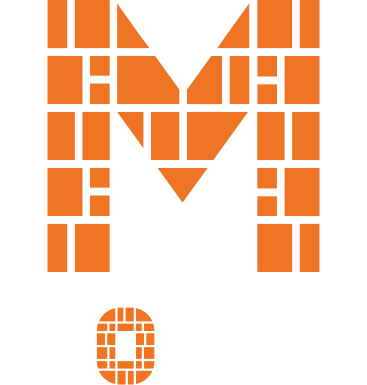
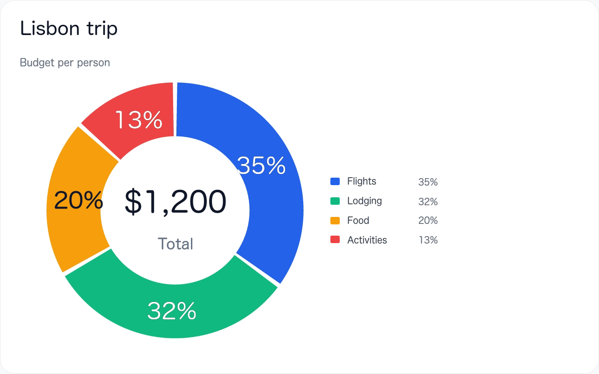
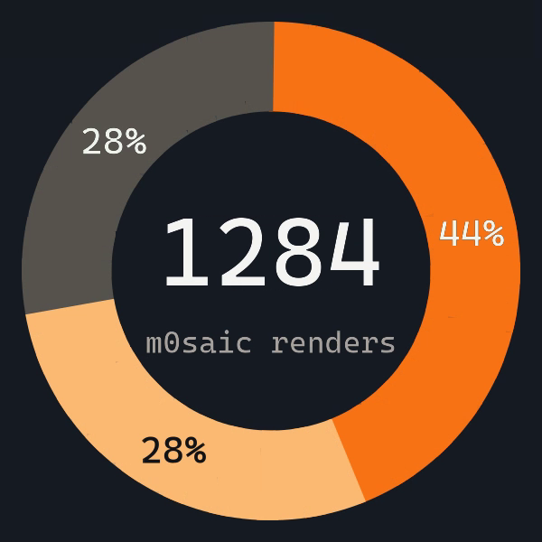
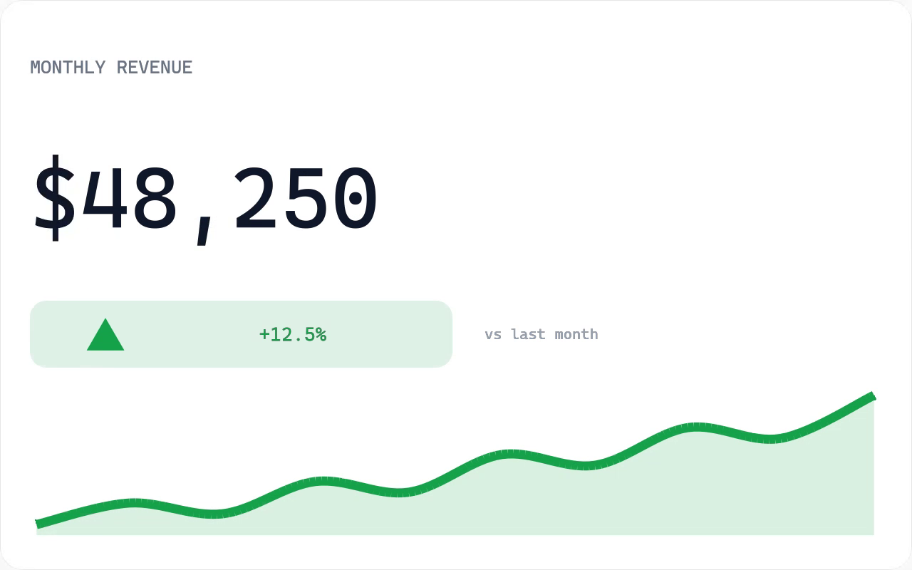
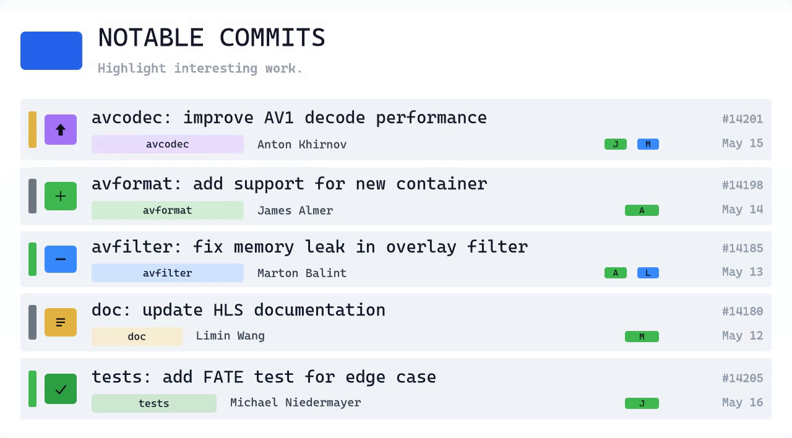
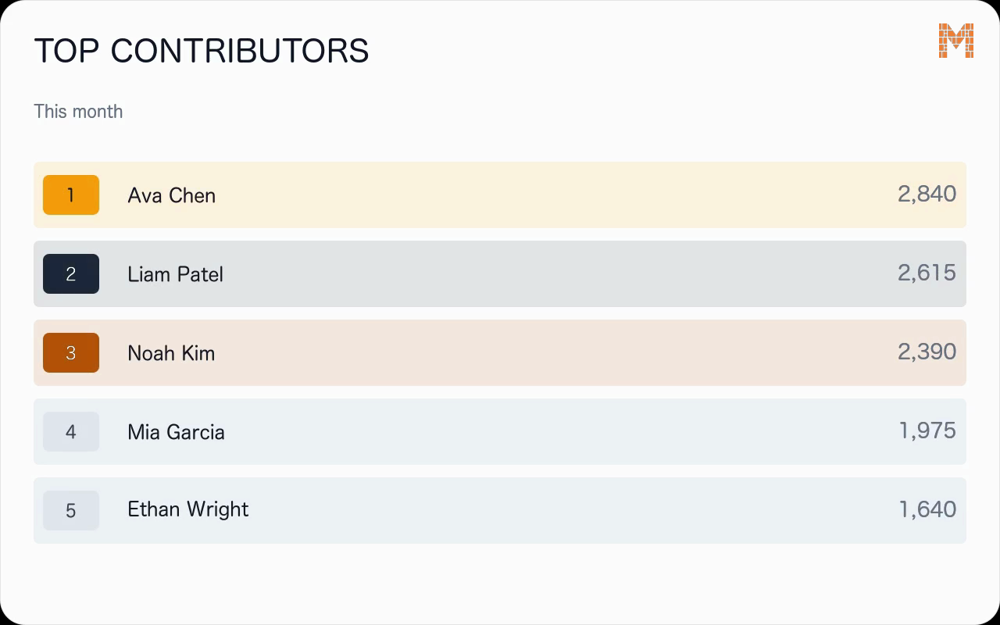
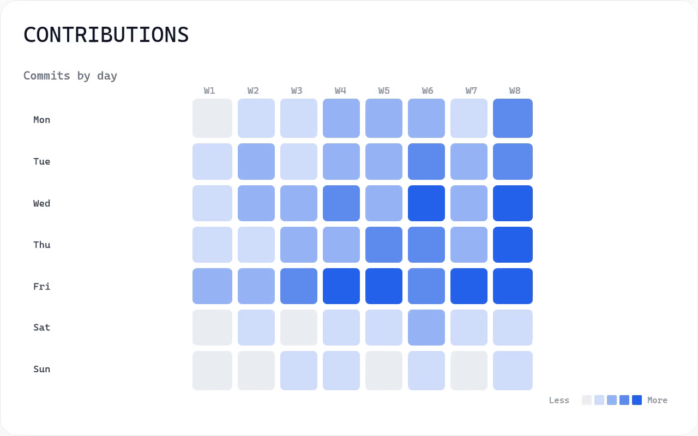

<p align="center">
  
</p>

<h3 align="center">Write TypeScript. Compile to video. Built for agents.</h3>

<p align="center">
  <a href="https://www.npmjs.com/package/m0saic"></a>
  <a href="https://m0saic.io"></a>
  <a href="https://app.m0saic.io"></a>
</p>

<p align="center">
  
</p>

m0saic is a video compiler. A template is a small TypeScript program that returns a **layout string**
(rectangles on a canvas) and one source per rectangle; m0saic compiles that to ffmpeg and hands you an MP4
or a PNG. There's no browser in the pipeline and no timeline to drag. The same template, data and canvas
give the same geometry at any resolution, so a render behaves like a build artifact you can test, diff
and re-run from a cron job or a coding agent.

```sh
npx m0saic hello-world
```

That's the whole first run. If you have no ffmpeg it says so, and `npx m0saic setup` fetches a pinned build
with your approval. (Node 18.17+; macOS, Windows and Linux.)

## Render something from your data

```sh
npm i -g m0saic
m0saic setup --yes
m0saic make @m0saic/alpine/donut/v4 --props @examples/budget/budget.json --output-kind image -o budget.png
```

<p align="center"></p>

Drop `--output-kind image` (and the `anim` prop) for the animated MP4. `-w 1080 -h 1920` re-lays the same
template for a vertical post; nothing is letterboxed. `m0saic list-templates` shows every template, and
[m0saic.io/llms-full.txt](https://m0saic.io/llms-full.txt) lists each one with its props.

## Give it to your coding agent

m0saic is built to be driven by agents: the layout is one string a validator can check, and a template is
code your agent can write. This repo is a Claude Code plugin and a set of Agent Skills, both wired to the m0saic MCP server.

**Claude Code**, as a plugin (skills + the MCP server):

```
/plugin marketplace add m0saic-project/m0saic
/plugin install m0saic@m0saic
```

**Any agent that reads [Agent Skills](https://agentskills.io)** (Codex, Cursor, Gemini CLI, OpenCode, Copilot and more):

```sh
npx skills add m0saic-project/m0saic
```

**Just the MCP server** (the knowledge base, every template's props, the layout validator, one-frame renders, the publish checks, and a live link into Mosaic Desktop):

```sh
claude mcp add --scope user m0saic -- npx -y m0saic mcp     # Claude Code
codex mcp add m0saic -- npx -y m0saic mcp                   # Codex
gemini extensions install https://github.com/m0saic-project/m0saic   # Gemini CLI
```

Cursor, Windsurf, Claude Desktop and other `mcpServers` clients:

```json
{ "mcpServers": { "m0saic": { "command": "npx", "args": ["-y", "m0saic", "mcp"] } } }
```

Then ask for what you want: *"make a 15-second vertical video of this week's commits"*, *"turn this CSV
into a bar chart I can post"*, *"build me a template for my podcast's episode cards"*. The skills tell the
agent when to render with an existing template and when to write a new one.

## The layout is a string

```
3(1,1,1)          three equal columns
2(F,3[F,F,F])     a column beside three stacked rows
2[F,F]{F}         two rows, with a layer on top
```

`(` splits across, `[` splits down, `{}` layers content over a tile. Every rectangle gets integer pixel
bounds: a three-way split of 1920 is 640/640/640, and when a split doesn't divide, the remainder is handed
out the same way every time. `npx m0saic "3(1,1,1)" --anim` renders any string you type as an animated
wireframe. The language is open (Apache-2.0) at [m0saic-dsl/m0](https://github.com/m0saic-dsl/m0).

## What people make with it

| | | |
|:-:|:-:|:-:|
| <br>`@m0saic/alpine/donut/v4` | <br>`@m0saic/alpine/kpi-card/v3` | <br>`@m0saic/alpine/commit-feed/v3` |
| <br>`@m0saic/alpine/leaderboard/v2` | <br>`@m0saic/alpine/heatmap/v3` | <br>`@m0saic/code/snippet-morph/v2` |

Charts, KPI and data cards, commit feeds and repo pulses, code walkthroughs, QR codes and barcodes, photo
collages, lyric reels, contact sheets, watermarks, blur regions, highlight clips. More at
[m0saic.io/gallery](https://m0saic.io/gallery), plus a [community library](https://github.com/m0saic-project/m0saic-community-templates)
and an agent that ships [one template a day](https://github.com/m0saic-project/one-a-day).

## How it compares

Three tools make video from code, each from a different source of truth:

| | Source of truth | Renders through |
|---|---|---|
| [Remotion](https://github.com/remotion-dev/remotion) | React components | a headless browser |
| [HyperFrames](https://github.com/heygen-com/hyperframes) | HTML, CSS and JavaScript | a headless browser + FFmpeg |
| **m0saic** | geometry: a layout string + one source per rectangle | FFmpeg only, no browser |

If you want to write React or HTML, use the first two; they're excellent. m0saic is for when the video is
data in, file out: on a server, in CI, from an agent, the same way every time, with nothing to draw in a
browser.

Related projects: [Revideo](https://github.com/midrender/revideo), [Motion Canvas](https://github.com/motion-canvas/motion-canvas),
[Editly](https://github.com/mifi/editly), [MoviePy](https://github.com/Zulko/moviepy), [Manim](https://github.com/ManimCommunity/manim).

## Everything else

| | |
|---|---|
| **CLI** | `npm i -g m0saic`: renders, `init` for a template workspace, `doctor` to check one, `mcp` for agents |
| **Mosaic Desktop** | macOS and Windows: edit templates on a live canvas, watch your agent work, render locally. [Download](https://m0saic.io/download) · [all releases](https://github.com/m0saic-project/mosaic-desktop-releases/releases) |
| **Mosaic Web** | [app.m0saic.io](https://app.m0saic.io): try every template in the browser; it hands you the CLI command for the render |
| **Write templates** | `m0saic init "My Templates"` scaffolds a repo with AGENTS.md and the MCP config already in it; starters: [full](https://github.com/m0saic-project/m0saic-template-repo-starter), [base](https://github.com/m0saic-project/m0saic-template-repo-starter-base) |
| **Packages** | the language, stdlib, file formats and template utilities are public: [m0saic-dsl/m0](https://github.com/m0saic-dsl/m0), [m0saic-packages](https://github.com/m0saic-project/m0saic-packages) |
| **For agents** | [m0saic.io/llms.txt](https://m0saic.io/llms.txt) · [m0saic.io/developers](https://m0saic.io/developers) |

## Open and commercial, plainly

The m0 language, its stdlib and file formats are Apache-2.0. The template library, the community library,
the starters and this repo are public. The engine, the CLI and the apps are commercial. **Free is the whole
engine**, every template and every resolution, with no account, for personal and commercial work; free
renders carry a small QR attribution mark in a corner. [Pro](https://m0saic.io/pricing) removes it.

## Issues and questions

Open an issue here for bugs, template requests and questions; this is m0saic's public front door. If m0saic
is useful to you, a star helps other people find it.
